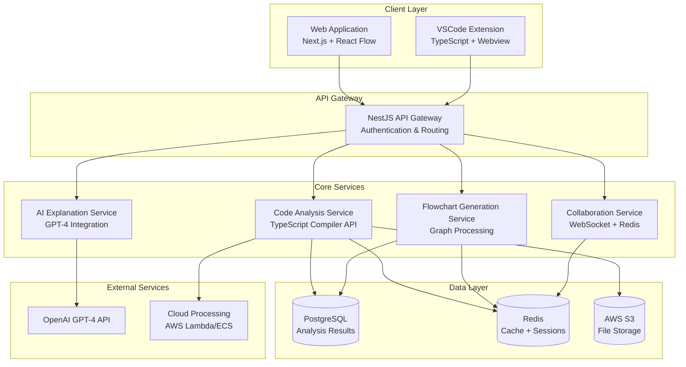

# Design Document: CodeFlow Pro

## Overview

CodeFlow Pro is a next-generation code visualization platform that automatically generates interactive flowcharts by analyzing entire codebases. The system combines advanced static code analysis with AI-powered explanations and real-time collaboration features to provide developers with comprehensive insights into their code structure and execution flow.

The platform supports multiple programming languages (JavaScript, TypeScript, Node.js, React.js) and provides both web-based and VSCode extension interfaces. The architecture is designed for scalability, handling large enterprise codebases through cloud-based processing while maintaining responsive user interactions.

## Architecture

### High-Level Architecture



### Service Architecture Pattern

The system follows a microservices architecture with the following key principles:

1. **Service Isolation**: Each core service (Code Analysis, Flowchart Generation, AI Explanation, Collaboration) operates independently
2. **Event-Driven Communication**: Services communicate through events and message queues for loose coupling
3. **Horizontal Scalability**: Services can be scaled independently based on demand
4. **Fault Tolerance**: Circuit breakers and retry mechanisms ensure system resilience

## Components and Interfaces

### Code Analysis Engine

**Purpose**: Parse and analyze source code to extract structural information and dependencies.

**Core Components**:
- **TypeScript Parser**: Uses TypeScript Compiler API for AST generation
- **Dependency Resolver**: Tracks imports, exports, and cross-file references  
- **Symbol Extractor**: Identifies functions, classes, variables, and their relationships
- **Cross-File Tracer**: Maps execution flow across multiple files

**Key Interfaces**:
```typescript
interface CodeAnalysisEngine {
  analyzeProject(projectPath: string): Promise<ProjectAnalysis>
  analyzeFile(filePath: string, context: ProjectContext): Promise<FileAnalysis>
  traceExecution(entryPoint: string): Promise<ExecutionFlow>
  extractDependencies(files: string[]): Promise<DependencyGraph>
}

interface ProjectAnalysis {
  files: FileAnalysis[]
  dependencies: DependencyGraph
  entryPoints: string[]
  metadata: ProjectMetadata
}

interface FileAnalysis {
  filePath: string
  ast: TypeScript.SourceFile
  symbols: Symbol[]
  imports: ImportDeclaration[]
  exports: ExportDeclaration[]
  functions: FunctionDeclaration[]
  classes: ClassDeclaration[]
}
```

### Flowchart Generation Service

**Purpose**: Convert analyzed code structure into interactive visual flowcharts.

**Core Components**:
- **Graph Builder**: Constructs node-edge graph from code analysis
- **Layout Engine**: Positions nodes using hierarchical and force-directed algorithms
- **Visual Renderer**: Generates React Flow compatible data structures
- **Interaction Handler**: Manages user interactions (click, drag, zoom)

**Key Interfaces**:
```typescript
interface FlowchartGenerator {
  generateFlowchart(analysis: ProjectAnalysis): Promise<FlowchartData>
  generateFileFlowchart(fileAnalysis: FileAnalysis): Promise<FlowchartData>
  updateLayout(flowchart: FlowchartData, layoutType: LayoutType): Promise<FlowchartData>
}

interface FlowchartData {
  nodes: FlowNode[]
  edges: FlowEdge[]
  layout: LayoutConfiguration
  metadata: FlowchartMetadata
}

interface FlowNode {
  id: string
  type: NodeType
  position: Position
  data: NodeData
  style: NodeStyle
}
```

### AI Explanation Service

**Purpose**: Provide intelligent code explanations and suggestions using GPT-4.

**Core Components**:
- **Context Builder**: Prepares code context for AI analysis
- **GPT-4 Client**: Manages OpenAI API interactions with rate limiting
- **Response Parser**: Processes and formats AI responses
- **Cache Manager**: Caches explanations to reduce API costs

**Key Interfaces**:
```typescript
interface AIExplanationService {
  explainCodeSection(code: string, context: CodeContext): Promise<Explanation>
  suggestImprovements(analysis: FileAnalysis): Promise<Suggestion[]>
  analyzePerformance(flowchart: FlowchartData): Promise<PerformanceInsights>
  detectSecurityIssues(code: string): Promise<SecurityIssue[]>
}

interface Explanation {
  summary: string
  details: string
  complexity: ComplexityScore
  suggestions: string[]
  relatedConcepts: string[]
}
```

### Collaboration Engine

**Purpose**: Enable real-time collaboration features for team-based code analysis.

**Core Components**:
- **WebSocket Manager**: Handles real-time connections
- **Presence Tracker**: Manages user presence and cursors
- **Annotation System**: Stores and syncs user comments and annotations
- **Session Manager**: Manages collaborative sessions

**Key Interfaces**:
```typescript
interface CollaborationEngine {
  createSession(projectId: string, userId: string): Promise<CollaborationSession>
  joinSession(sessionId: string, userId: string): Promise<void>
  broadcastUpdate(sessionId: string, update: CollaborationUpdate): Promise<void>
  addAnnotation(annotation: Annotation): Promise<void>
}

interface CollaborationSession {
  id: string
  projectId: string
  participants: User[]
  annotations: Annotation[]
  cursors: UserCursor[]
}
```

## Data Models

### Core Data Structures

**Project Model**:
```typescript
interface Project {
  id: string
  name: string
  description: string
  language: SupportedLanguage
  repositoryUrl?: string
  createdAt: Date
  updatedAt: Date
  ownerId: string
  settings: ProjectSettings
}

interface ProjectSettings {
  analysisDepth: AnalysisDepth
  excludePatterns: string[]
  includeTestFiles: boolean
  enableAIExplanations: boolean
  collaborationEnabled: boolean
}
```

**Analysis Result Model**:
```typescript
interface AnalysisResult {
  id: string
  projectId: string
  version: string
  status: AnalysisStatus
  startedAt: Date
  completedAt?: Date
  fileCount: number
  analysisData: ProjectAnalysis
  errors: AnalysisError[]
}

enum AnalysisStatus {
  PENDING = 'pending',
  IN_PROGRESS = 'in_progress',
  COMPLETED = 'completed',
  FAILED = 'failed'
}
```

**Flowchart Model**:
```typescript
interface FlowchartModel {
  id: string
  projectId: string
  analysisResultId: string
  name: string
  type: FlowchartType
  data: FlowchartData
  createdAt: Date
  updatedAt: Date
  isPublic: boolean
  collaborators: string[]
}

enum FlowchartType {
  PROJECT_OVERVIEW = 'project_overview',
  FILE_SPECIFIC = 'file_specific',
  FUNCTION_FLOW = 'function_flow',
  DEPENDENCY_GRAPH = 'dependency_graph'
}
```

### Database Schema

**PostgreSQL Tables**:
- `projects`: Project metadata and settings
- `analysis_results`: Stored analysis data with versioning
- `flowcharts`: Generated flowchart data and metadata
- `users`: User accounts and preferences
- `collaboration_sessions`: Active collaboration sessions
- `annotations`: User comments and annotations
- `ai_explanations`: Cached AI-generated explanations

**Redis Data Structures**:
- `session:{sessionId}`: Active collaboration sessions
- `presence:{projectId}`: Real-time user presence
- `cache:analysis:{hash}`: Cached analysis results
- `cache:ai:{hash}`: Cached AI explanations
- `queue:analysis`: Analysis job queue

## Correctness Properties

*A property is a characteristic or behavior that should hold true across all valid executions of a system—essentially, a formal statement about what the system should do. Properties serve as the bridge between human-readable specifications and machine-verifiable correctness guarantees.*

### Property Reflection

After analyzing all acceptance criteria, several properties can be consolidated to eliminate redundancy:

- Properties 1.1-1.4 (language-specific parsing) can be combined into a comprehensive parsing property
- Properties 2.1-2.3 (cross-file tracing) can be unified into a single dependency resolution property  
- Properties 4.1-4.2 (AI explanations and suggestions) can be combined into one AI service property
- Properties 6.1-6.3 (service detection) can be consolidated into a single service identification property
- Properties 7.1, 7.2, 7.4 (real-time collaboration features) can be unified into a collaboration synchronization property
- Properties 9.1-9.2 (data storage and caching) can be combined into a data persistence property

### Core Properties

**Property 1: Multi-language code parsing completeness**
*For any* supported codebase (JavaScript, TypeScript, Node.js, React.js), the Code_Analyzer should successfully parse all files and extract all function definitions, calls, dependencies, and language-specific constructs (components, imports, exports)
**Validates: Requirements 1.1, 1.2, 1.3, 1.4**

**Property 2: Analysis result persistence**
*For any* completed code analysis, the parsed AST and analysis results should be stored in the database and be retrievable for flowchart generation
**Validates: Requirements 1.6**

**Property 3: Cross-file dependency resolution**
*For any* function call or import that references another file, the Cross_File_Tracer should correctly identify the target location, follow import/export chains, and map all inter-module relationships
**Validates: Requirements 2.1, 2.2, 2.3**

**Property 4: Dynamic import handling**
*For any* code containing dynamic imports, the Cross_File_Tracer should identify all potential target modules
**Validates: Requirements 2.4**

**Property 5: Circular dependency detection**
*For any* codebase with circular dependencies, the Cross_File_Tracer should detect them and handle them gracefully without infinite loops
**Validates: Requirements 2.5**

**Property 6: Flowchart generation from analysis**
*For any* valid code analysis result, the Flowchart_Generator should produce a valid flowchart with nodes and edges representing the execution flow
**Validates: Requirements 3.1**

**Property 7: Node-to-code mapping accuracy**
*For any* flowchart node, clicking it should navigate to the correct corresponding source code location
**Validates: Requirements 3.3**

**Property 8: Flowchart filtering functionality**
*For any* applied filter criteria (complexity, file type, etc.), the Interactive_Viewer should show only nodes that match the criteria and hide all others
**Validates: Requirements 3.5**

**Property 9: AI explanation generation**
*For any* selected code section, the AI_Explainer should generate explanations and suggestions, and these should be cached for future requests
**Validates: Requirements 4.1, 4.2, 4.5**

**Property 10: Security and performance analysis**
*For any* code with security vulnerabilities or performance bottlenecks, the AI_Explainer should identify and highlight these issues with appropriate recommendations
**Validates: Requirements 4.3, 4.4**

**Property 11: Service call detection**
*For any* code containing HTTP requests, database operations, or external API calls, the Code_Analyzer should correctly identify and categorize these service interactions
**Validates: Requirements 6.1, 6.2, 6.3**

**Property 12: Service call visual distinction**
*For any* flowchart containing service calls, these should be visually distinguished from regular function calls through different styling or indicators
**Validates: Requirements 6.4**

**Property 13: End-to-end flow tracing**
*For any* full-stack application, the System should trace and display complete request paths from frontend through backend to database
**Validates: Requirements 6.5**

**Property 14: Real-time collaboration synchronization**
*For any* collaborative session with multiple users, all user actions (cursor movements, annotations, selections) should be immediately broadcast and synchronized across all connected clients
**Validates: Requirements 7.1, 7.2, 7.4**

**Property 15: Comment persistence and sharing**
*For any* comment added to a code section, it should be persisted in the database and visible to all team members with access to the project
**Validates: Requirements 7.3**

**Property 16: Collaboration state consistency**
*For any* active collaboration session, the system state should remain consistent across all connected clients despite concurrent user actions
**Validates: Requirements 7.5**

**Property 17: Code complexity calculation**
*For any* function in the analyzed code, the Performance_Analyzer should calculate accurate cyclomatic complexity scores
**Validates: Requirements 8.1**

**Property 18: Performance metrics display**
*For any* available performance data, the System should correctly display execution times and bottlenecks in the flowcharts with appropriate visual indicators
**Validates: Requirements 8.2, 8.4**

**Property 19: Security vulnerability identification**
*For any* code with potential security issues, the Performance_Analyzer should identify and report these vulnerabilities
**Validates: Requirements 8.3**

**Property 20: Optimization recommendations**
*For any* identified optimization opportunity, the System should provide actionable recommendations
**Validates: Requirements 8.5**

**Property 21: Data persistence and caching**
*For any* analysis result or frequently accessed data, the System should store it in PostgreSQL with proper indexing and serve frequently accessed data from Redis cache
**Validates: Requirements 9.1, 9.2**

**Property 22: Incremental analysis**
*For any* codebase update, the System should detect changes and re-analyze only the modified files, preserving analysis results for unchanged files
**Validates: Requirements 9.3**

**Property 23: User preference persistence**
*For any* user preference setting, it should be persisted across sessions and correctly restored when the user returns
**Validates: Requirements 9.4**

**Property 24: Large data compression**
*For any* large analysis result, the System should implement efficient compression for storage and maintain fast retrieval performance
**Validates: Requirements 9.5**

**Property 25: Analysis progress reporting**
*For any* queued analysis job, the System should provide real-time progress updates to users throughout the analysis process
**Validates: Requirements 10.2**

**Property 26: Error handling and recovery**
*For any* failed analysis, the System should provide detailed error messages and implement retry mechanisms for transient failures
**Validates: Requirements 10.4**

**Property 27: Multi-channel notifications**
*For any* completed processing task, the System should notify users through appropriate channels (web notifications, email, etc.)
**Validates: Requirements 10.5**

## Error Handling

### Error Categories and Strategies

**Code Analysis Errors**:
- **Syntax Errors**: Gracefully handle malformed code by reporting specific error locations and continuing analysis of valid files
- **Dependency Resolution Failures**: When imports cannot be resolved, log warnings but continue analysis with available information
- **Large File Handling**: Implement file size limits and provide clear error messages for files exceeding limits
- **Memory Exhaustion**: Implement circuit breakers to prevent system crashes during analysis of extremely large codebases

**AI Service Errors**:
- **API Rate Limiting**: Implement exponential backoff and queue management for OpenAI API calls
- **API Failures**: Provide fallback explanations and cache previous results when AI service is unavailable
- **Context Length Limits**: Automatically truncate code sections while preserving essential context for AI analysis
- **Invalid Responses**: Validate AI responses and provide default explanations when responses are malformed

**Collaboration Errors**:
- **WebSocket Disconnections**: Implement automatic reconnection with exponential backoff
- **State Synchronization Conflicts**: Use operational transformation or conflict-free replicated data types (CRDTs) for conflict resolution
- **Session Timeouts**: Gracefully handle session expiration with user notifications and data preservation

**Data Persistence Errors**:
- **Database Connection Failures**: Implement connection pooling with automatic retry and failover mechanisms
- **Cache Misses**: Gracefully degrade to database queries when Redis cache is unavailable
- **Storage Quota Exceeded**: Implement data cleanup policies and user notifications for storage limits

### Error Recovery Mechanisms

**Graceful Degradation**:
- Core functionality (code analysis and basic flowchart generation) continues even when advanced features (AI explanations, collaboration) fail
- Partial analysis results are preserved and displayed when complete analysis fails
- Offline mode for VSCode extension when cloud services are unavailable

**User Communication**:
- Clear, actionable error messages with suggested remediation steps
- Progress indicators that show partial completion status during failures
- Notification system for informing users about service status and recovery

## Testing Strategy

### Dual Testing Approach

The testing strategy employs both unit testing and property-based testing to ensure comprehensive coverage:

**Unit Tests**: Focus on specific examples, edge cases, and error conditions
- Integration points between services
- Specific code parsing scenarios (malformed syntax, edge cases)
- API endpoint behavior with known inputs
- Database operations with specific data sets
- UI component behavior with predefined interactions

**Property-Based Tests**: Verify universal properties across all inputs using generated test data
- Code parsing completeness across randomly generated codebases
- Cross-file dependency resolution with various project structures  
- Flowchart generation consistency with different analysis inputs
- Real-time collaboration synchronization under concurrent user actions
- Data persistence and retrieval across different data sizes and types

### Property-Based Testing Configuration

**Testing Framework**: Use `fast-check` for JavaScript/TypeScript property-based testing
- Minimum 100 iterations per property test to ensure statistical confidence
- Custom generators for creating realistic code structures, project hierarchies, and user interactions
- Shrinking capabilities to find minimal failing examples when properties fail

**Test Tagging**: Each property-based test must reference its corresponding design property
- Tag format: **Feature: codeflow-pro, Property {number}: {property_text}**
- Example: **Feature: codeflow-pro, Property 1: Multi-language code parsing completeness**

**Coverage Requirements**:
- All 27 correctness properties must be implemented as property-based tests
- Each property test validates the universal behavior described in the property statement
- Property tests complement unit tests by covering the full input space rather than specific examples

### Integration Testing

**End-to-End Workflows**:
- Complete code analysis pipeline from upload to flowchart generation
- Multi-user collaboration scenarios with concurrent actions
- Cross-platform consistency between web application and VSCode extension
- AI explanation generation and caching workflows

**Performance Testing**:
- Large codebase analysis (1000+ files) within acceptable time limits
- Concurrent user load testing for collaboration features
- Memory usage profiling during analysis of complex codebases
- API response time testing under various load conditions

**Security Testing**:
- Input validation for uploaded code files
- Authentication and authorization for collaboration features
- API rate limiting and abuse prevention
- Data privacy and isolation between projects

### Continuous Integration

**Automated Testing Pipeline**:
- Unit tests run on every commit with 90%+ code coverage requirement
- Property-based tests run nightly with extended iteration counts (1000+ per property)
- Integration tests run on pull requests with staging environment deployment
- Performance regression testing on release candidates

**Quality Gates**:
- All tests must pass before deployment
- Code coverage thresholds enforced at service level
- Property test failure investigation required before release
- Security scan results must show no high-severity vulnerabilities