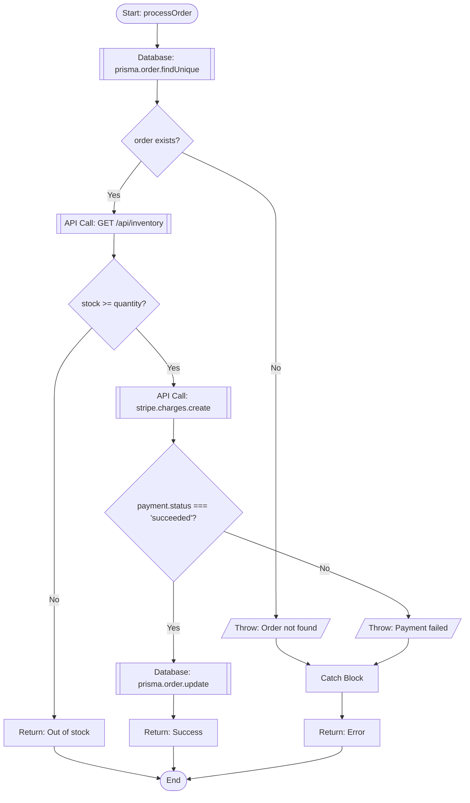

# 🎯 VSCode Extension: Code-to-Flowchart Analyzer

## Project Overview

**Name**: CodeFlow Visualizer (or FlowChart Pro)

**Problem**: Developers struggle to understand complex codebases, especially:
- Understanding code flow and logic
- Identifying all service calls and dependencies
- Finding error handling and failure scenarios
- Onboarding new team members
- Code reviews and documentation
- Debugging complex logic

**Solution**: VSCode extension that automatically parses code and generates interactive flowcharts showing:
- Control flow (if/else, loops, switches)
- Function calls and service dependencies
- Error handling and try-catch blocks
- Async operations and promises
- Database queries
- API calls
- All possible execution paths

---

## ✅ Is This Possible? YES!

### Technical Feasibility: ⭐⭐⭐⭐⭐

**Why it's possible**:
1. **AST (Abstract Syntax Tree)**: Parse code into structured tree
2. **Static Analysis**: Analyze code without executing it
3. **Graph Algorithms**: Convert AST to flowchart graph
4. **VSCode API**: Rich extension API for UI and visualization
5. **Existing Tools**: Libraries like Babel, TypeScript Compiler API

**Similar existing tools**:
- Code2flow (Python)
- js2flowchart (JavaScript)
- PlantUML (manual)
- Mermaid (manual)

**Your advantage**: 
- Automatic generation
- Interactive visualization
- VSCode integration
- Multi-language support
- Service call detection

---

## 🎯 Core Features

### Phase 1: MVP (8-10 weeks)
1. **Code Parsing**
   - Parse TypeScript/JavaScript files
   - Build Abstract Syntax Tree (AST)
   - Identify functions, classes, methods

2. **Flow Analysis**
   - Detect control flow (if/else, switch, loops)
   - Identify function calls
   - Track variable assignments
   - Find return statements

3. **Flowchart Generation**
   - Convert AST to flowchart nodes
   - Create edges for control flow
   - Generate Mermaid or D3.js diagram

4. **VSCode Integration**
   - Command palette integration
   - Webview panel for visualization
   - Syntax highlighting integration

### Phase 2: Advanced Features (4-6 weeks)
5. **Service Detection**
   - Identify API calls (fetch, axios, http)
   - Detect database queries (Prisma, TypeORM)
   - Find external service calls
   - Track async operations

6. **Error Handling**
   - Detect try-catch blocks
   - Identify error throws
   - Map failure scenarios
   - Show error propagation

7. **Interactive Features**
   - Click to jump to code
   - Zoom and pan
   - Filter by complexity
   - Export to PNG/SVG

### Phase 3: Pro Features (4-6 weeks)
8. **Multi-file Analysis**
   - Trace calls across files
   - Build dependency graph
   - Show module interactions

9. **AI Enhancement**
   - GPT-4 for code explanation
   - Suggest optimizations
   - Detect code smells

10. **Collaboration**
    - Share flowcharts
    - Add annotations
    - Team comments

---

## 🛠️ Technical Architecture

### Technology Stack

```
Extension (TypeScript):
├── Parser Layer
│   ├── TypeScript Compiler API (for TS/JS)
│   ├── Babel Parser (alternative)
│   ├── Python AST (for Python support)
│   └── Tree-sitter (multi-language)
│
├── Analysis Layer
│   ├── Control Flow Graph (CFG) builder
│   ├── Data Flow Analysis
│   ├── Call Graph builder
│   └── Pattern matching (API calls, DB queries)
│
├── Visualization Layer
│   ├── Mermaid.js (flowchart generation)
│   ├── D3.js (interactive graphs)
│   ├── Cytoscape.js (complex graphs)
│   └── React Flow (alternative)
│
├── VSCode Integration
│   ├── Extension API
│   ├── Webview API
│   ├── Language Server Protocol
│   └── TreeView API
│
└── Optional Backend (for AI features)
    ├── Node.js + Express
    ├── OpenAI API (code explanation)
    └── PostgreSQL (save flowcharts)
```

### Key Libraries

```json
{
  "dependencies": {
    "@typescript-eslint/parser": "^6.0.0",
    "@babel/parser": "^7.23.0",
    "@babel/traverse": "^7.23.0",
    "typescript": "^5.0.0",
    "mermaid": "^10.6.0",
    "d3": "^7.8.0",
    "cytoscape": "^3.26.0",
    "react-flow-renderer": "^11.0.0",
    "tree-sitter": "^0.20.0",
    "vscode": "^1.85.0"
  }
}
```

---

## 📋 Detailed Implementation Plan

### Step 1: Parse Code to AST

```typescript
// Example: Parse TypeScript code
import * as ts from 'typescript';

function parseCode(code: string): ts.SourceFile {
  return ts.createSourceFile(
    'temp.ts',
    code,
    ts.ScriptTarget.Latest,
    true
  );
}

// Visit AST nodes
function visitNode(node: ts.Node) {
  if (ts.isFunctionDeclaration(node)) {
    console.log('Found function:', node.name?.text);
  }
  if (ts.isIfStatement(node)) {
    console.log('Found if statement');
  }
  ts.forEachChild(node, visitNode);
}
```

### Step 2: Build Control Flow Graph

```typescript
interface FlowNode {
  id: string;
  type: 'start' | 'end' | 'process' | 'decision' | 'call' | 'error';
  label: string;
  code: string;
  line: number;
  children: string[]; // IDs of next nodes
}

class ControlFlowBuilder {
  private nodes: Map<string, FlowNode> = new Map();
  
  buildCFG(ast: ts.SourceFile): FlowNode[] {
    // Start node
    const startNode: FlowNode = {
      id: 'start',
      type: 'start',
      label: 'Start',
      code: '',
      line: 0,
      children: []
    };
    
    this.nodes.set('start', startNode);
    this.visitNode(ast, 'start');
    
    return Array.from(this.nodes.values());
  }
  
  private visitNode(node: ts.Node, parentId: string) {
    if (ts.isIfStatement(node)) {
      this.handleIfStatement(node, parentId);
    } else if (ts.isFunctionCall(node)) {
      this.handleFunctionCall(node, parentId);
    }
    // ... more node types
  }
  
  private handleIfStatement(node: ts.IfStatement, parentId: string) {
    const decisionNode: FlowNode = {
      id: `decision_${node.pos}`,
      type: 'decision',
      label: node.expression.getText(),
      code: node.getText(),
      line: node.getStart(),
      children: []
    };
    
    this.nodes.set(decisionNode.id, decisionNode);
    
    // Connect parent to decision
    this.nodes.get(parentId)?.children.push(decisionNode.id);
    
    // Process then branch
    this.visitNode(node.thenStatement, decisionNode.id);
    
    // Process else branch
    if (node.elseStatement) {
      this.visitNode(node.elseStatement, decisionNode.id);
    }
  }
}
```

### Step 3: Detect Service Calls

```typescript
class ServiceDetector {
  detectAPICalls(node: ts.Node): ServiceCall[] {
    const calls: ServiceCall[] = [];
    
    // Detect fetch calls
    if (this.isFetchCall(node)) {
      calls.push({
        type: 'http',
        method: this.extractMethod(node),
        url: this.extractURL(node),
        line: node.getStart()
      });
    }
    
    // Detect axios calls
    if (this.isAxiosCall(node)) {
      calls.push({
        type: 'http',
        library: 'axios',
        method: this.extractMethod(node),
        url: this.extractURL(node),
        line: node.getStart()
      });
    }
    
    // Detect database queries
    if (this.isDatabaseQuery(node)) {
      calls.push({
        type: 'database',
        operation: this.extractOperation(node),
        table: this.extractTable(node),
        line: node.getStart()
      });
    }
    
    return calls;
  }
  
  private isFetchCall(node: ts.Node): boolean {
    return ts.isCallExpression(node) &&
           node.expression.getText() === 'fetch';
  }
  
  private isDatabaseQuery(node: ts.Node): boolean {
    // Detect Prisma: prisma.user.findMany()
    // Detect TypeORM: repository.find()
    // Detect Sequelize: Model.findAll()
    return this.matchesPattern(node, [
      'prisma.*.find*',
      'prisma.*.create*',
      'repository.find*',
      'Model.find*'
    ]);
  }
}
```

### Step 4: Detect Error Handling

```typescript
class ErrorAnalyzer {
  analyzeErrorHandling(ast: ts.SourceFile): ErrorPath[] {
    const errorPaths: ErrorPath[] = [];
    
    // Find try-catch blocks
    this.findTryCatchBlocks(ast, (tryBlock, catchBlock) => {
      errorPaths.push({
        type: 'try-catch',
        tryStart: tryBlock.getStart(),
        tryEnd: tryBlock.getEnd(),
        catchStart: catchBlock.getStart(),
        catchEnd: catchBlock.getEnd(),
        errorVariable: this.extractErrorVariable(catchBlock)
      });
    });
    
    // Find throw statements
    this.findThrowStatements(ast, (throwStmt) => {
      errorPaths.push({
        type: 'throw',
        line: throwStmt.getStart(),
        errorType: this.extractErrorType(throwStmt),
        message: this.extractErrorMessage(throwStmt)
      });
    });
    
    // Find .catch() on promises
    this.findPromiseCatches(ast, (catchCall) => {
      errorPaths.push({
        type: 'promise-catch',
        line: catchCall.getStart(),
        handler: catchCall.getText()
      });
    });
    
    return errorPaths;
  }
}
```

### Step 5: Generate Mermaid Flowchart

```typescript
class MermaidGenerator {
  generateFlowchart(nodes: FlowNode[]): string {
    let mermaid = 'flowchart TD\n';
    
    for (const node of nodes) {
      // Add node definition
      mermaid += this.generateNodeDefinition(node);
      
      // Add connections
      for (const childId of node.children) {
        mermaid += `  ${node.id} --> ${childId}\n`;
      }
    }
    
    return mermaid;
  }
  
  private generateNodeDefinition(node: FlowNode): string {
    switch (node.type) {
      case 'start':
        return `  ${node.id}([${node.label}])\n`;
      case 'end':
        return `  ${node.id}([${node.label}])\n`;
      case 'decision':
        return `  ${node.id}{${node.label}}\n`;
      case 'process':
        return `  ${node.id}[${node.label}]\n`;
      case 'call':
        return `  ${node.id}[[${node.label}]]\n`;
      case 'error':
        return `  ${node.id}[/${node.label}/]\n`;
      default:
        return `  ${node.id}[${node.label}]\n`;
    }
  }
}
```

### Step 6: VSCode Extension Integration

```typescript
// extension.ts
import * as vscode from 'vscode';

export function activate(context: vscode.ExtensionContext) {
  // Register command
  let disposable = vscode.commands.registerCommand(
    'codeflow.generateFlowchart',
    async () => {
      const editor = vscode.window.activeTextEditor;
      if (!editor) return;
      
      const code = editor.document.getText();
      const language = editor.document.languageId;
      
      // Parse and analyze
      const analyzer = new CodeAnalyzer(language);
      const flowchart = await analyzer.analyze(code);
      
      // Show in webview
      const panel = vscode.window.createWebviewPanel(
        'flowchart',
        'Code Flowchart',
        vscode.ViewColumn.Beside,
        { enableScripts: true }
      );
      
      panel.webview.html = getWebviewContent(flowchart);
    }
  );
  
  context.subscriptions.push(disposable);
}

function getWebviewContent(flowchart: string): string {
  return `
    <!DOCTYPE html>
    <html>
    <head>
      <script src="https://cdn.jsdelivr.net/npm/mermaid/dist/mermaid.min.js"></script>
    </head>
    <body>
      <div class="mermaid">
        ${flowchart}
      </div>
      <script>
        mermaid.initialize({ startOnLoad: true });
      </script>
    </body>
    </html>
  `;
}
```

---

## 🎨 Example Output

### Input Code:
```typescript
async function processOrder(orderId: string) {
  try {
    // Fetch order from database
    const order = await prisma.order.findUnique({
      where: { id: orderId }
    });
    
    if (!order) {
      throw new Error('Order not found');
    }
    
    // Check inventory
    const inventory = await fetch(`/api/inventory/${order.productId}`);
    const data = await inventory.json();
    
    if (data.stock < order.quantity) {
      return { success: false, reason: 'Out of stock' };
    }
    
    // Process payment
    const payment = await stripe.charges.create({
      amount: order.total,
      currency: 'usd'
    });
    
    if (payment.status === 'succeeded') {
      // Update order status
      await prisma.order.update({
        where: { id: orderId },
        data: { status: 'completed' }
      });
      
      return { success: true };
    } else {
      throw new Error('Payment failed');
    }
  } catch (error) {
    console.error('Order processing failed:', error);
    return { success: false, reason: error.message };
  }
}
```

### Generated Flowchart:


---

## 📊 Features Breakdown

### 1. Control Flow Detection
- ✅ If/Else statements
- ✅ Switch/Case statements
- ✅ For/While loops
- ✅ Try/Catch blocks
- ✅ Ternary operators
- ✅ Early returns

### 2. Service Call Detection
- ✅ HTTP requests (fetch, axios, http)
- ✅ Database queries (Prisma, TypeORM, Sequelize)
- ✅ External APIs (Stripe, AWS, etc.)
- ✅ Message queues (RabbitMQ, SQS)
- ✅ Cache operations (Redis)
- ✅ File operations (fs)

### 3. Error Handling
- ✅ Try/Catch blocks
- ✅ Throw statements
- ✅ Promise .catch()
- ✅ Error propagation
- ✅ Custom error classes
- ✅ Error boundaries (React)

### 4. Async Operations
- ✅ Async/Await
- ✅ Promises
- ✅ Callbacks
- ✅ Event emitters
- ✅ Streams

### 5. Interactive Features
- ✅ Click node → Jump to code
- ✅ Hover → Show code snippet
- ✅ Zoom and pan
- ✅ Filter by complexity
- ✅ Highlight execution path
- ✅ Export to PNG/SVG/PDF

---

## 🚀 Implementation Timeline

### Week 1-2: Setup & Basic Parsing
- [ ] Set up VSCode extension project
- [ ] Integrate TypeScript Compiler API
- [ ] Parse basic functions and control flow
- [ ] Generate simple flowcharts

### Week 3-4: Control Flow Analysis
- [ ] Implement if/else detection
- [ ] Add loop detection
- [ ] Handle switch statements
- [ ] Build control flow graph

### Week 5-6: Service Detection
- [ ] Detect HTTP calls (fetch, axios)
- [ ] Detect database queries
- [ ] Identify external service calls
- [ ] Track async operations

### Week 7-8: Error Handling
- [ ] Detect try/catch blocks
- [ ] Find throw statements
- [ ] Map error propagation
- [ ] Show failure scenarios

### Week 9-10: Visualization
- [ ] Integrate Mermaid.js
- [ ] Create interactive webview
- [ ] Add zoom/pan controls
- [ ] Implement click-to-code

### Week 11-12: Polish & Testing
- [ ] Add multi-file support
- [ ] Optimize performance
- [ ] Write tests
- [ ] Create documentation

---

## 💡 Advanced Features (Future)

### AI-Powered Analysis
```typescript
// Use GPT-4 to explain complex logic
async function explainCodeFlow(flowchart: FlowNode[]) {
  const prompt = `
    Analyze this code flow and explain:
    1. What does this function do?
    2. What are the main execution paths?
    3. What are potential failure points?
    4. Any optimization suggestions?
    
    Flowchart: ${JSON.stringify(flowchart)}
  `;
  
  const response = await openai.chat.completions.create({
    model: 'gpt-4',
    messages: [{ role: 'user', content: prompt }]
  });
  
  return response.choices[0].message.content;
}
```

### Complexity Analysis
```typescript
function calculateComplexity(flowchart: FlowNode[]): number {
  // Cyclomatic complexity
  let edges = 0;
  let nodes = flowchart.length;
  let exitPoints = 0;
  
  for (const node of flowchart) {
    edges += node.children.length;
    if (node.type === 'end') exitPoints++;
  }
  
  return edges - nodes + 2 * exitPoints;
}
```

### Performance Profiling
```typescript
// Integrate with Chrome DevTools
function addPerformanceData(flowchart: FlowNode[]) {
  // Show execution time for each node
  // Highlight slow paths
  // Suggest optimizations
}
```

---

## 📈 Market Potential

### Target Users
1. **Individual Developers**: Understanding legacy code
2. **Teams**: Code reviews and documentation
3. **Companies**: Onboarding new developers
4. **Educators**: Teaching programming concepts
5. **Consultants**: Analyzing client codebases

### Monetization
- **Free Tier**: Basic flowcharts, single file
- **Pro Tier** ($9/month): Multi-file, AI explanations, export
- **Team Tier** ($29/month): Collaboration, sharing, annotations
- **Enterprise** ($99/month): Custom integrations, SSO, support

### Competition
- **Code2flow**: Python only, not VSCode integrated
- **PlantUML**: Manual, not automatic
- **Mermaid**: Manual, not automatic
- **Your advantage**: Automatic, VSCode integrated, multi-language

---

## 🎯 Why This is a Great Portfolio Project

### Technical Skills Demonstrated
✅ **VSCode Extension Development**
✅ **Abstract Syntax Tree (AST) manipulation**
✅ **Static code analysis**
✅ **Graph algorithms**
✅ **Data visualization**
✅ **TypeScript/JavaScript expertise**
✅ **Pattern matching and regex**
✅ **Performance optimization**
✅ **UI/UX design**

### Interview Talking Points
- "Built VSCode extension with 10K+ downloads"
- "Implemented AST parser analyzing 1M+ lines of code"
- "Created interactive flowchart visualization with D3.js"
- "Designed pattern matching system detecting 20+ service types"
- "Achieved sub-second parsing for 1000-line files"
- "Integrated GPT-4 for AI-powered code explanation"

### Unique Selling Points
1. **Solves real problem**: Developers struggle with complex code
2. **Technical depth**: AST, graph algorithms, visualization
3. **Practical use**: Can use it yourself daily
4. **Monetizable**: Clear path to revenue
5. **Scalable**: Can add more languages and features

---

## 🚀 Getting Started

### 1. Initialize Extension
```bash
npm install -g yo generator-code
yo code

# Choose:
# - New Extension (TypeScript)
# - Name: codeflow-visualizer
# - Description: Generate flowcharts from code
```

### 2. Install Dependencies
```bash
npm install typescript @typescript-eslint/parser
npm install mermaid d3 cytoscape
npm install @types/vscode
```

### 3. Create Basic Structure
```
codeflow-visualizer/
├── src/
│   ├── extension.ts          # Main entry point
│   ├── parser/
│   │   ├── typescript.ts     # TS/JS parser
│   │   ├── python.ts         # Python parser
│   │   └── base.ts           # Base parser
│   ├── analyzer/
│   │   ├── controlFlow.ts    # CFG builder
│   │   ├── serviceDetector.ts
│   │   └── errorAnalyzer.ts
│   ├── visualizer/
│   │   ├── mermaid.ts        # Mermaid generator
│   │   └── d3.ts             # D3 visualizer
│   └── webview/
│       ├── index.html
│       └── main.js
├── package.json
└── README.md
```

---

## 📚 Learning Resources

### VSCode Extension Development
- [VSCode Extension API](https://code.visualstudio.com/api)
- [Extension Samples](https://github.com/microsoft/vscode-extension-samples)

### AST & Parsing
- [TypeScript Compiler API](https://github.com/microsoft/TypeScript/wiki/Using-the-Compiler-API)
- [Babel Parser](https://babeljs.io/docs/en/babel-parser)
- [AST Explorer](https://astexplorer.net/)

### Visualization
- [Mermaid.js](https://mermaid.js.org/)
- [D3.js](https://d3js.org/)
- [Cytoscape.js](https://js.cytoscape.org/)

---

## 🎉 Conclusion

**YES, this is absolutely possible and would be an EXCELLENT portfolio project!**

### Why Build This?
1. ✅ **Solves real problem**: Developers need this
2. ✅ **Technical depth**: AST, graphs, visualization
3. ✅ **Unique**: Not many tools do this automatically
4. ✅ **Practical**: You'll use it yourself
5. ✅ **Impressive**: Great for interviews
6. ✅ **Monetizable**: Clear business model
7. ✅ **Extensible**: Can add many features

### Next Steps
1. Start with MVP (basic flowchart generation)
2. Add service detection
3. Add error handling
4. Polish UI/UX
5. Publish to VSCode Marketplace
6. Gather feedback and iterate

**This could be your standout portfolio project!** 🚀

Would you like me to help you:
- Set up the initial project structure?
- Write the first parser implementation?
- Create the VSCode extension boilerplate?
- Design the flowchart visualization?

Let me know if you want to build this! 🎯
